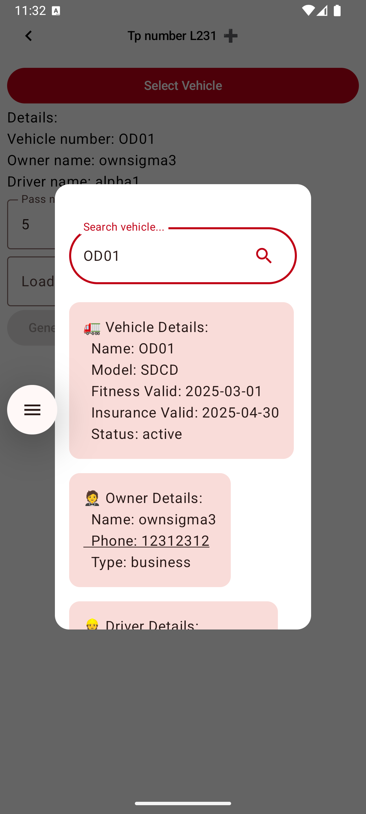

# 📱 Business Development Mobilizer X Android App

A simple and user-friendly Android application built with Jetpack Compose, designed to Manage Orders and Status of Individual Trips.

---

## ✨ Features

- ✅ Feature 1 (e.g., Login & Registration)
- 📅 Feature 2 (e.g., Orders and Transportation Lists and options)
- 📊 Feature 3 (e.g., Statistics Dashboard)
- 🔒 Secure with [e.g., Firebase Auth / Room DB]

---

## 📸 Screenshots

| Orders                                    | Transport                                    | Add                                              |
|-------------------------------------------|----------------------------------------------|--------------------------------------------------|
|  |  |  |

---

## 🚀 Getting Started

### Requirements

- Android Studio Electric Eel or newer
- Kotlin 1.8+
- Gradle 8.0+
- Minimum SDK 17

### Installation

```bash
git clone https://github.com/pnrt/bdmxa.git
cd bdmxa
```
### Desktop App
👉 
